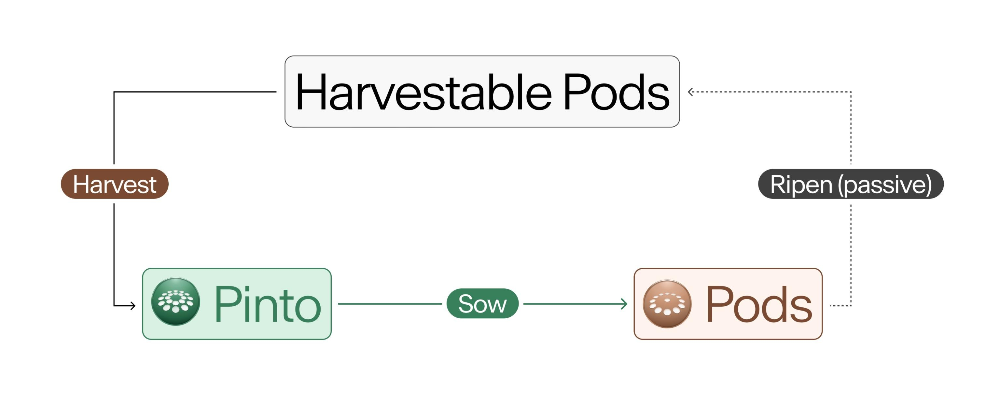

# Field

The Pinto target maintenance mechanism requires a way to decrease the supply of Pinto when the price is too low. The protocol uses credit to borrow Pinto and burn them, thereby removing them from the supply.

The Field is a permissionless market for lending Pinto to the protocol.  Anytime there is Soil in the Field, anyone can lend Pinto to the protocol (_i.e._, Sow) in exchange for Pods, the protocol-native debt asset.&#x20;

The Temperature at the time Pinto was Sown determines the number of Pods received. Pods become Harvestable for 1 Pinto each on a FIFO basis.&#x20;

The protocol conducts a Dutch auction for Pods during the first 10 minutes of each Season (_i.e._, the Morning). The Soil and Temperature change throughout the Morning according to the [target maintenance mechanism](../target-maintenance/overview.md).

### **Soil**

Anytime the protocol is willing to issue debt, there is Soil in the Field. Soil represents the number of Pinto that the protocol is currently willing to borrow.

When Pinto are Sown, the protocol burns them, permanently removing the Sown Pinto from the Pinto supply. For example, if there's 10 Soil available and 10 Pinto are Sown, the Soil supply becomes 0 and 10 Pinto are removed from the Pinto supply. If the market is in some sort of equilibrium, Pinto are bought to be Sown, which drives the Pinto price upward towards its value target.

When TWA∆P (the sum of the time weighted average shortages or excesses of Pinto across liquidity pools on the [Minting Whitelist](sun.md#minting-whitelist)) ≥ 0, the Soil supply decreases logarithmically during the Morning and is a function of the [Maximum Temperature](../target-maintenance/temperature.md). When TWA∆P < 0, the Soil supply is set as a function of the [Liquidity Rate](../target-maintenance/overview.md#liquidity-level) and [Cultivation Factor](../resources/glossary.md#cultivation-factor). See the [Soil Supply](../target-maintenance/overview.md#soil-supply) section for more info.

### **Pods**

Pinto are Sown in exchange for Pods, the protocol-native debt asset. Loans are issued with a fixed interest rate, known as Temperature, and an unknown maturity date.

The number of Pods received from 1 Sown Pinto is determined by the Temperature at the time of Sowing. Newly issued Pods accumulate in the back of the Pod Line. The front of the Pod Line receives a portion of Pinto mints as outlined in [Shipping Routes](sun.md#shipping-routes).

Pods become Harvestable Pods that can be Harvested (redeemed) for 1 Pinto each on a First In, First Out ([FIFO](../resources/glossary.md#fifo)) basis. There is no penalty for waiting to Harvest Pods.

Pods are tradeable on the [Pod Market](toolshed/pod-market.md). Pods can also be transferred to another address directly.

### **Temperature**

The Temperature is the interest rate for Sowing Pinto in the Field. At 500% Temperature, 1 Pinto can be Sown in exchange for 6 Pods. Once those Pods become Harvestable, they can be Harvested in exchange for 6 Pinto.

The protocol [changes the Maximum Temperature](../target-maintenance/temperature.md) it is willing to offer each Season at the beginning of each Season according to the target maintenance mechanism.&#x20;

[During the Morning](../target-maintenance/temperature.md#morning) of each Season, the Temperature is the result of a Dutch auction, where the Temperature increases logarithmically from 1% of the Maximum Temperature to the Maximum Temperature over the course of 10 minutes. During times of short-term excess demand for Soil, the Morning results in the protocol paying significantly less to attract creditors.

### **Field Process**

<figure><figcaption></figcaption></figure>

1. Pinto are Sown in exchange for Pods.
2. Pods become Harvestable Pods on a FIFO basis when the protocol mints new Pinto according to the target maintenance mechanism.
3. Harvestable Pods can be Harvested into Pinto.

### **Economics**

Pinto is credit based and only fails if it can no longer attract creditors. A reasonable level of debt, a strong credit history and a competitive interest rate attract creditors.

Pinto never defaults on debt (although in the event of Pinto no longer attracting creditors, the loan maturity date would become infinitely far in the future—see [Disclosures](../resources/terms.md#no-lender-of-last-resort)). The protocol is willing to issue Pods every Season.

The combination of non-expiry, the FIFO Harvest schedule and transferability encourages Farmers to Sow Pinto as efficiently as possible. By maximizing the efficiency of the Soil market, the protocol minimizes its cost to attract creditors, the durations and magnitudes of price deviations below its value target, and excess Pinto minting.
