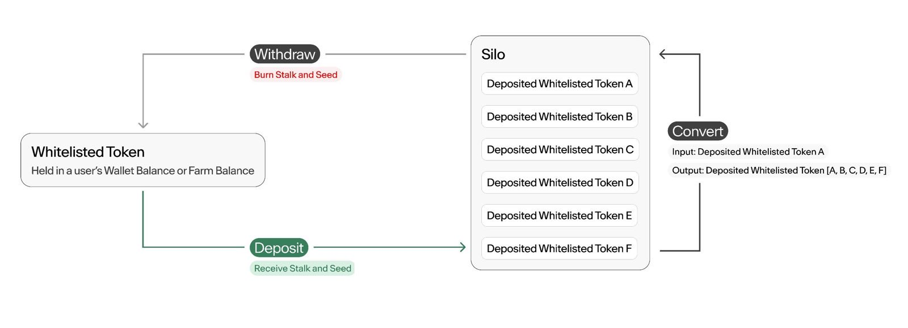

# Silo

The Silo is the Deposit facility of Pinto. The Silo uses the Stalk System to create protocol-native financial incentives that improve Pinto's liquidity and reduce volatility.

Anyone can become a Stalkholder by Depositing assets on the Deposit Whitelist in the Silo to earn Stalk and Seeds. Neither Stalk nor Seeds are liquid. Deposits are represented as [ERC-1155](https://eips.ethereum.org/EIPS/eip-1155) standard tokens.

### **Deposit Whitelist** 

To be Deposited into the Silo, an ERC-20 Standard token must be on the Deposit Whitelist. In order for a token to be on the Deposit Whitelist, Pinto requires:

1. The token address;
2. The optimal percentage of Deposited LP PDV (Pinto Denominated Value); and
3. Other details documented in [Section 5.1.1](https://pinto.money/pinto.pdf#subsubsection.5.1.1) of the whitepaper.

#### **Current Deposit Whitelist**

<table><thead><tr><th width="367.6015625">Whitelisted asset</th><th>Optimal % Deposited LP PDV</th></tr></thead><tbody><tr><td>PINTO</td><td>N/A</td></tr><tr><td><a href="https://pinto.exchange/#/wells/8453/0x3e11001cfbb6de5737327c59e10afab47b82b5d3">PINTOWETH LP</a></td><td>12.5%</td></tr><tr><td><a href="https://pinto.exchange/#/wells/8453/0x3e111115a82df6190e36adf0d552880663a4dbf1">PINTOcbETH LP</a></td><td>12.5%</td></tr><tr><td><a href="https://pinto.exchange/#/wells/8453/0x3e11226fe3d85142b734abce6e58918d5828d1b4">PINTOcbBTC LP</a></td><td>25%</td></tr><tr><td><a href="https://pinto.exchange/#/wells/8453/0x3e11444c7650234c748d743d8d374fce2ee5e6c9">PINTOWSOL LP</a></td><td>25%</td></tr><tr><td><a href="https://pinto.exchange/#/wells/8453/0x3e1133ac082716ddc3114bbefeed8b1731ea9cb1">PINTOUSDC LP</a></td><td>25%</td></tr></tbody></table>

### **The Stalk System** 

When whitelisted assets are Deposited into the Silo, Pinto rewards the Depositor with Stalk and Seeds. Seeds yield 1/10000 new (Grown) Stalk every [Season](https://docs.bean.money/almanac/farm/sun). A Farmer's Seed balance can change every Season per the [Seed Gauge System](../advanced/seed-gauge-system.md).

Stalkholders earn a portion of Pinto mints. Distribution of Pinto mints are proportional to each Stalkholder's Stalk balance relative to total outstanding Stalk.

Older Deposits have their Stalk ownership diluted by newer Deposits upon Deposit. Stalk ownership decentralizes over time. Therefore, newly minted Pinto are more widely distributed over time.

Stalkholders receive a portion of Pinto mints as outlined in [Shipping Routes](sun.md#shipping-routes).

#### **Germination**

Stalk is rewarded to a Deposit 2 gm calls after Deposit. In the interim, new Deposits are considered Germinating. Germinating Deposits can be Withdrawn or transferred, but cannot be Converted.

### **Withdraw** 

The associated amount of Stalk and Seeds from a given Deposit must be forfeited when the Deposit is Withdrawn from the Silo. The requirement to forfeit Stalk that has grown from Seeds over time (Mown Stalk) creates an opportunity cost to leave the Silo, thereby increasing the stickiness of Deposits the longer they stay Deposited.

Deposits can be Withdrawn from the Silo at any time. Deposits can be transferred to another address directly without the loss of Stalk and Seeds.

### **Convert** 

Conversions within the Silo between Pinto and LP Deposits serve a major role in target maintenance. LP token Deposits can also be Converted to other LP token Deposits for a potential gain in Stalk and/or Seeds.

See [Convert](../target-maintenance/convert.md) section for more information.

<figure><figcaption></figcaption></figure>

### The Seed Gauge System 

Seeds generate opportunity cost for Withdrawing assets that have been Deposited for longer and marginal benefit for holding particular assets in the Silo in the form of Grown Stalk.

The Seed Gauge System enables the protocol to target a particular Grown Stalk inflation rate and determine the relative benefits of holding exposure to various whitelisted assets in the Silo.

There are 3 primary components of the Gauge System:

1. The Target Seasons to Catch Up, which determines the target number of Seasons for a new Deposit with an average number of Seeds to catch up to the average Grown Stalk per PDV of existing Deposits (at the time of Deposit);
2. Pinto vs LP Seed distribution, known as the [Crop Ratio](../target-maintenance/crop-ratio.md), which determines the relative benefits of holding Pinto exposure vs exposure to the LP token with the most Seeds in the Silo over time; and
3. LP vs LP Seed distribution, which determines relative benefits of holding a given non-Pinto asset in the Silo over time.

See [Seed Gauge System](../advanced/seed-gauge-system.md) section for more information.

### **Silo Rewards** 


The following reward types are all abstracted away as Claimable Pinto, Stalk and Seeds in the [Pinto UI](https://pinto.money). Any time you claim one of these in the Pinto UI, you claim all of them.


Earned Pinto are Pinto that have been paid to a Stalkholder since the last Season the Stalkholder claimed them (Planted). Upon Plant, Earned Pinto become Deposited Pinto.

Earned Stalk are Stalk earned from Earned Pinto. Earned Stalk automatically contribute to Stalk ownership and do not require any action to claim them.

Grown Stalk is the Stalk earned from Seeds. Grown Stalk does not contribute to Stalk ownership until it is claimed (Mown). Mow can be called on its own, and it is also called at the beginning of any Silo interaction (Depositing, Withdrawing, Converting, Planting, etc.).

Plantable Seeds are Seeds earned in conjunction with Earned Pinto. Plantable Seeds must be Planted in order to grow Stalk.
